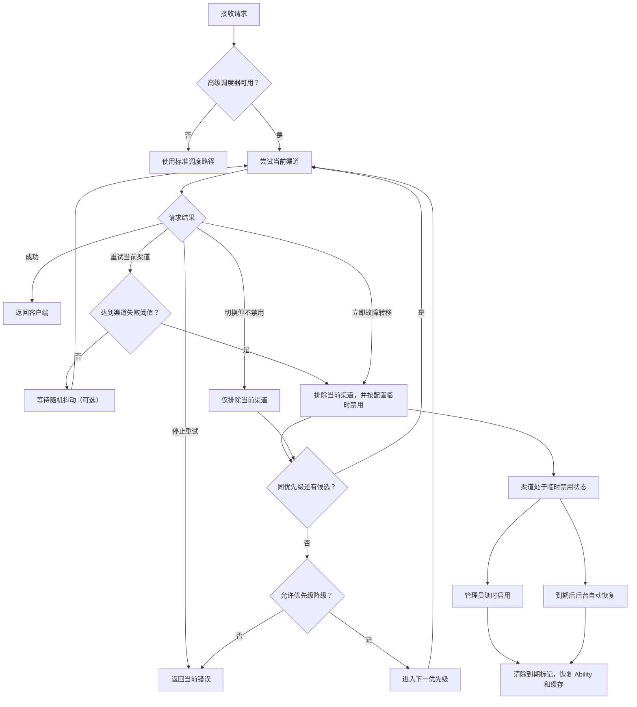

# New API 调度增强版

本仓库基于 [QuantumNous/new-api](https://github.com/QuantumNous/new-api) 维护，提供完整的 New API 网关能力，并加入高级渠道调度、转发韧性、调度日志和 Windows 本地开发脚本。

- 项目仓库：[ccw-HE/new-api](https://github.com/ccw-HE/new-api)
- 上游仓库：[QuantumNous/new-api](https://github.com/QuantumNous/new-api)
- 上游文档：[docs.newapi.pro](https://docs.newapi.pro/)
- 基础使用说明：[README.md](./README.md) 和 [README.zh_CN.md](./README.zh_CN.md)

New API、QuantumNous、许可证、NOTICE、模块路径和原始署名保持不变。本说明只描述当前仓库可用的功能和使用方式。

## 功能概览

| 能力 | 说明 |
| --- | --- |
| 高级渠道调度 | 单渠道达到失败阈值后，优先切换到同优先级渠道，可选降级到更低优先级 |
| 动态尝试预算 | 单次请求预算由唯一、启用候选渠道的有效失败阈值累加得出，不使用固定总次数上限 |
| 临时禁用与恢复 | 故障渠道可临时禁用，到期后自动恢复，管理员也可随时通过普通启用操作恢复 |
| HTTP 状态码规则 | 自动重试和自动禁用支持单值、闭区间和组合配置 |
| 重试随机抖动 | 支持关闭、固定延迟和随机区间，降低集中故障时的瞬时重试压力 |
| 调度日志 | 记录失败、观察禁用、自动禁用、自动恢复和人工恢复事件 |
| 空响应检测 | 检测 OpenAI、Responses、Gemini、Claude 等响应中是否存在可交付内容 |
| Header 安全透传 | 支持占位符、通配继承和正则匹配，同时过滤认证与协议级敏感字段 |
| 请求体与流生命周期 | 支持重试时重放请求体，并加强流式响应和进程退出处理 |
| Windows 一键启动 | `start.bat` 管理 Docker、后端、Default WebUI 和本项目进程生命周期 |

## 高级渠道调度器

高级调度器为每个请求创建独立会话。失败计数只在当前请求中存在，不跨请求、进程或节点累计。



### 调度规则

- 全局 `enabled=false` 时使用标准调度路径。
- 指定 `specific_channel_id` 的请求不由高级调度器接管。
- 候选渠道按 `priority` 从高到低分桶，同一优先级内按权重随机选择。
- `retry_same_channel=true` 时，当前渠道在达到失败阈值前继续承担重试。
- 渠道达到阈值后会从当前会话排除。满足禁用条件时写入临时禁用状态，否则记录 `observe_disable`。
- 同优先级候选耗尽后，只有 `allow_priority_fallback=true` 才会尝试更低优先级。
- Token 分组为 `auto` 时，候选按用户自动分组顺序展开；是否继续跨分组取决于 Token 的跨分组重试设置。

### 动态尝试预算

每个请求的尝试预算等于所有唯一、启用候选渠道的有效失败阈值之和。渠道级阈值为空或非法时使用全局阈值，单渠道阈值范围为 `1-100`。

预算和尝试计数使用 `int64`。调度会在预算用尽、候选耗尽、请求取消或错误被判定为不可重试时停止。

### 错误处置

| 处置 | 行为 | 常见情况 |
| --- | --- | --- |
| `stop` | 停止调度并返回当前错误 | 请求取消、固定渠道、明确跳过重试、正常 `2xx` 业务停止 |
| `retry_current` | 当前渠道失败计数加一，未到阈值时继续当前渠道 | 渠道错误、空响应、命中自动重试状态码 |
| `failover_without_disable` | 排除当前渠道，不执行临时禁用 | 建连或发送失败、上游内容拦截 |
| `failover_now` | 立即进入排除和临时禁用判断 | 未命中重试规则的 `408`、`429` 和 `5xx` |

## HTTP 状态码规则

自动重试和自动禁用使用独立配置，支持逗号分隔的单值和闭区间：

```text
401,408,429,500-503
```

解析器接受半角或中文逗号，会去除空格、排序并合并相邻区间。状态码必须在 `100-599` 之间，区间起点不能大于终点。

默认自动重试范围：

```text
100-199,300-399,401-407,409-499,500-503,505-523,525-599
```

默认自动禁用状态码为 `401`。

规则行为：

- 高级调度器命中自动重试范围时使用 `retry_current`。
- 未命中范围的 `408`、`429` 和 `5xx` 使用 `failover_now`。
- `504` 和 `524` 在标准重试路径中始终跳过重试；高级调度器只有在配置范围明确包含它们时才重试当前渠道，否则立即故障转移。
- `bad_response_body` 在标准重试路径中始终跳过重试。
- 空响应错误由高级调度器按渠道失败处理，不依赖 HTTP 状态码是否命中范围。
- 自动重试规则决定请求是否继续，自动禁用规则还用于标准调度路径和多 Key 渠道的 Key 级处理，两者用途不同。

## 重试随机抖动

随机抖动在每次调度重试前等待一段时间，用于分散集中故障时的重试请求。

- 最小值和最大值均为 `0` 时关闭。
- 非零配置范围为 `100-10000` 毫秒，且最小值不能大于最大值。
- 两个值相等时使用固定延迟，不相等时在闭区间内随机取值。
- 客户端取消请求后会立即停止等待。
- 运行时遇到非法配置会关闭抖动，管理接口会拒绝非法配置。

## 临时禁用与恢复

渠道达到失败阈值后，调度器会先把它从当前请求排除，再检查以下条件：

- 渠道仍处于启用状态。
- 渠道允许参与高级调度。
- 开启 `respect_auto_ban` 时，渠道自身的 `auto_ban` 已启用。

满足条件后，系统写入 `status=auto_disabled`、`auto_disabled_until`、状态原因和状态时间，同时禁用对应 Ability，并更新渠道缓存。默认禁用时长为 `7200` 秒，可配置范围为 `1` 秒到 `30` 天。

自动恢复任务每分钟检查一次可恢复渠道，只处理以下记录：

- `status=auto_disabled`
- `auto_disabled_until>0` 且已到期
- 渠道未关闭 `scheduler_auto_recover_enabled`

自动恢复会重新启用 Ability 并重建渠道缓存。手动禁用渠道和没有到期时间的旧式自动禁用渠道不会被后台任务恢复。

管理员拥有渠道操作权限时，可以随时使用渠道列表中的普通“启用”操作恢复渠道，不需要等待 `auto_disabled_until` 到期。成功启用后会清除到期标记、恢复 Ability、刷新缓存、写入管理审计日志，并在调度日志开启时记录 `manual_restore` 事件。批量启用使用相同规则。

## 配置参考

### 全局配置

| 字段 | 默认值 | 约束 | 作用 |
| --- | ---: | --- | --- |
| `enabled` | `false` | 布尔值 | 启用高级调度器 |
| `channel_failure_threshold` | `3` | `1-100` | 单渠道在单次请求中的失败阈值 |
| `auto_disable_seconds` | `7200` | `1-2592000` | 临时禁用时长 |
| `retry_jitter_min_ms` | `0` | `0` 或 `100-10000` | 重试等待下限 |
| `retry_jitter_max_ms` | `0` | `0` 或 `100-10000` | 重试等待上限，不能小于下限 |
| `allow_priority_fallback` | `true` | 布尔值 | 同级耗尽后是否进入更低优先级 |
| `log_enabled` | `true` | 布尔值 | 是否写入调度日志 |
| `respect_auto_ban` | `true` | 布尔值 | 是否遵守渠道自身的自动禁用开关 |
| `retry_same_channel` | `true` | 布尔值 | 是否优先在当前渠道重试到阈值 |

全局配置使用 `channel_scheduler_setting.*` 选项持久化，修改需要 Root 权限。

### 渠道级配置

| 字段 | 继承行为 | 作用 |
| --- | --- | --- |
| `scheduler_enabled` | `null` 等同于 `true` | 是否允许调度器临时禁用该渠道 |
| `scheduler_retry_times` | `null` 使用全局阈值 | 渠道失败阈值，范围 `1-100` |
| `scheduler_auto_disable_seconds` | `null` 使用全局时长 | 渠道临时禁用时长，范围 `1` 秒到 `30` 天 |
| `scheduler_auto_recover_enabled` | `null` 等同于 `true` | 到期后是否允许后台自动恢复 |
| `auto_disabled_until` | `0` | 当前调度器临时禁用的 Unix 到期时间 |

渠道级配置接口采用全量替换语义，字段为 `null` 时清除覆盖并恢复继承。

## 调度日志与管理界面

调度日志事件包括：

| 事件 | 说明 |
| --- | --- |
| `failure` | 单次渠道失败 |
| `observe_disable` | 达到阈值但未实际禁用 |
| `auto_disable` | 调度器临时禁用渠道 |
| `auto_recover` | 到期后自动恢复 |
| `manual_restore` | 管理员通过普通启用操作恢复渠道 |

日志记录请求、用户、Token、分组、模型、渠道、优先级、错误信息、尝试次数、禁用时长和扩展元数据，不记录渠道密钥。日志写入失败不会中断转发主链路。

管理入口：

- 渠道页面的“高级调度器”：全局设置和临时禁用渠道列表。
- 渠道行操作的“调度设置”：渠道级覆盖配置。
- 使用日志页面的“调度日志”：筛选、统计和查看详情。
- 渠道列表的“启用”：立即恢复自动禁用或手动禁用渠道。

主要管理 API：

| 方法和路径 | 权限 | 用途 |
| --- | --- | --- |
| `GET /api/channel_scheduler/logs` | Admin | 查询调度日志 |
| `GET /api/channel_scheduler/logs/stat` | Admin | 查询调度统计 |
| `DELETE /api/channel_scheduler/logs` | Root | 删除指定时间前的调度日志 |
| `GET /api/channel_scheduler/disabled` | Admin | 查询临时禁用渠道 |
| `GET /api/channel_scheduler/config` | Root | 获取全局配置 |
| `PUT /api/channel_scheduler/config` | Root | 保存全局配置 |
| `GET /api/channel_scheduler/channel/:id/config` | Admin | 获取渠道级配置 |
| `PUT /api/channel_scheduler/channel/:id/config` | Root | 保存渠道级配置 |
| `POST /api/channel/:id/status` | ChannelOperate | 启用或手动禁用渠道 |

调度器接口同时提供 `/api/channel-scheduler` 连字符兼容前缀。

## 转发韧性

### 空响应检测

高级调度器启用时，转发层会检查响应中是否存在可交付内容：

- OpenAI Chat：文本、推理内容或工具调用。
- OpenAI Responses：输出文本、函数调用、图像生成调用或其他工具调用。
- Gemini：文本、函数调用、内联媒体、可执行代码或代码执行结果。
- Claude：Completion 文本、Content 文本、Thinking 或工具调用。
- OpenAI 流式响应：整个流结束后仍没有文本、推理、音频或工具调用时返回空响应错误。

空响应转换为统一的 `502` 类错误，使调度器能够继续重试或故障转移。检测只判断是否存在可交付载荷，不评价内容质量。

### Header 继承与安全透传

渠道 Header 覆盖支持：

- `{api_key}`：替换为当前渠道 API Key。
- `{client_header:<name>}`：读取客户端请求中的指定 Header，客户端内容不会再次展开 `{api_key}`。
- `"*"`：非测试请求默认继承安全 Header；设置为字符串 `"false"` 时关闭默认继承，其他值启用。
- `re:<regex>` 和 `regex:<regex>`：使用 Go 正则表达式按 Header 名选择透传字段。

透传规则先执行，显式渠道 Header 后执行，因此显式配置优先。适配器已经生成同名 Header 时，普通透传不会覆盖它；显式渠道配置仍可覆盖适配器结果。

通配和正则透传不会复制以下字段：

- `Authorization`、`API-Key`、`X-API-Key`、`X-Goog-API-Key`
- `Cookie`、`Host`、`Content-Length`、`Accept-Encoding`
- Hop-by-hop Header，包括 `Connection`、`Keep-Alive`、`Transfer-Encoding`、`Upgrade` 等
- 代理认证字段和 WebSocket 握手字段

空正则、非法正则、缺少请求上下文、非字符串覆盖值和错误占位符会返回明确的渠道 Header 配置错误。

### 请求体和流式生命周期

- 重试链路使用可重新读取的请求体存储，避免首次请求消费 Body 后后续尝试得到空 Body。
- 请求体长度未知时不会写入错误的 `Content-Length`。
- 流式响应保留必要的上游 Header，并在请求取消或进程退出时结束相关生命周期。

## 数据库兼容性

- 支持 SQLite、MySQL 和 PostgreSQL。
- 调度字段和 `channel_scheduler_logs` 表通过现有 GORM 迁移流程创建，不需要手工执行专用 SQL。
- 调度日志写入主数据库，不随独立日志数据库配置迁移。
- 内存缓存开启或关闭时使用相同的优先级分桶语义。
- 禁用时更新渠道状态、到期时间和 Ability；恢复时重建渠道缓存。

升级生产数据库前应先完成备份，并在副本上验证迁移。

## 安装与启动

### 环境要求

- Go `1.25.1` 或更高版本
- Bun
- Docker Desktop，可选但 Windows 一键启动需要
- Node.js 和 npm，仅在维护 Electron 或相关锁文件时需要

### Windows 一键启动

在仓库根目录双击 `start.bat`，或运行：

```powershell
.\start.bat
```

脚本会检查 Docker 和 Bun，通过 `docker-compose.dev.yml` 启动后端、PostgreSQL 和 Redis，然后启动 Default WebUI 并打开浏览器。

- 后端：http://localhost:3000
- Default WebUI：http://localhost:3001

可用命令：

| 命令 | 行为 |
| --- | --- |
| `.\start.bat` | 启动开发环境，源码指纹变化时自动重建后端镜像 |
| `.\start.bat build` | 强制重建后端镜像后启动 |
| `.\start.bat rebuild` | 与 `build` 相同 |
| `.\start.bat probe` | 只显示源码指纹和镜像重建判断 |
| `.\start.bat stop` | 停止 WebUI 和 Compose 服务，保留 Docker Desktop、容器和数据卷 |
| `.\start.bat stop-all` | 在 `stop` 基础上请求关闭 Docker Desktop |

`run scripts/` 中的 PowerShell 文件由 `start.bat` 调用，用于进程归属检查、生命周期清理和脚本回归测试，不是独立启动入口。

### 本地构建

后端：

```powershell
go mod download
go test ./...
go build .
```

Default 前端：

```powershell
Set-Location web
bun install --frozen-lockfile
Set-Location default
bun run typecheck
bun test
bun run build
```

Classic 前端：

```powershell
Set-Location web\classic
bun run build
```

### Docker

Windows 本地开发可直接使用 `start.bat`。其他环境可从当前源码构建镜像：

```bash
docker build -t ccw-he/new-api:local .
docker run --name new-api -d --restart always \
  -p 3000:3000 \
  -e TZ=Asia/Shanghai \
  -v "$(pwd)/data:/data" \
  ccw-he/new-api:local
```

生产环境应修改数据库、Redis、Session 和管理员凭据等默认配置，并持久化数据库文件或外部数据库实例。

## 已知限制

- 高级调度器默认关闭，需要 Root 管理员显式启用。
- 渠道失败计数只存在于单次请求内，不是跨请求或跨节点熔断器。
- 自动恢复按分钟调度，不保证到期后在同一秒恢复；管理员可随时手动启用。
- `scheduler_enabled=false` 阻止调度器实际临时禁用渠道，但渠道仍可能在请求中被选择并在会话内排除。
- 关闭优先级降级后，同优先级候选耗尽即结束本次调度。
- 空响应检测只能判断是否存在可交付载荷，不能判断内容质量或业务正确性。
- 调度日志会增加主数据库写入量和存储占用，应配置合理的保留与清理策略。

## 许可证与署名

本仓库继续遵循 [GNU Affero General Public License v3.0](./LICENSE)。修改和分发时必须保留 [NOTICE](./NOTICE) 中的原始归属、用户界面署名和上游项目链接。

- 不得删除或替换 New API、QuantumNous 和贡献者的原始署名。
- 向公众提供修改后的网络服务时，应履行 AGPLv3 对应的源代码提供义务。
- 发布二进制、Docker 镜像、前端包或 Electron 安装包时，应保留 LICENSE、NOTICE 和第三方许可证文件。
