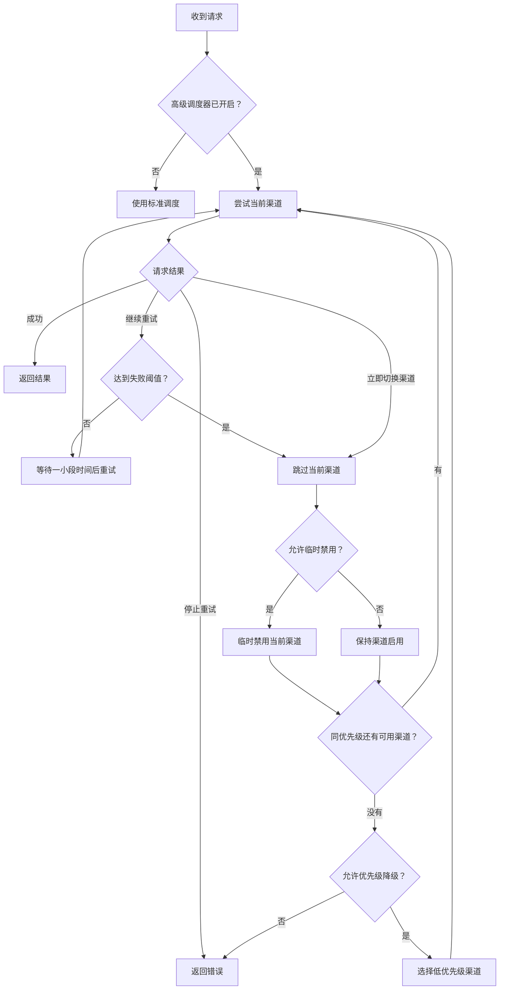

# New API 调度增强版

本仓库基于 [QuantumNous/new-api](https://github.com/QuantumNous/new-api)，提供完整的 New API 网关能力，并加入渠道故障转移、调度日志和 Windows 本地启动支持。

- 项目仓库：[ccw-HE/new-api](https://github.com/ccw-HE/new-api)
- 上游仓库：[QuantumNous/new-api](https://github.com/QuantumNous/new-api)
- 上游文档：[docs.newapi.pro](https://docs.newapi.pro/)
- 基础使用说明：[README.md](./README.md)、[README.zh_CN.md](./README.zh_CN.md)

New API、QuantumNous、许可证、NOTICE、模块路径和原始署名保持不变。本文只介绍当前仓库的主要功能和使用方法。

## 功能概览

| 功能 | 说明 |
| --- | --- |
| 渠道故障转移 | 一个渠道出问题后，自动尝试同优先级的其他渠道，也可以继续尝试更低优先级渠道 |
| 自动禁用与恢复 | 连续失败的渠道可以暂时停用，到期自动恢复，管理员也能随时手动启用 |
| 灵活重试 | 重试次数按候选渠道和失败阈值自动计算，不使用固定总次数上限 |
| HTTP 状态码规则 | 可以配置哪些状态码需要重试或触发自动禁用 |
| 随机重试等待 | 可关闭，也可以设置固定等待或随机等待，减少集中重试 |
| 调度日志 | 查看渠道失败、自动禁用、自动恢复和人工恢复 |
| 空响应检测 | 上游返回空内容时，及时进入重试或故障转移 |
| Header 安全透传 | 透传需要的客户端 Header，同时过滤认证信息和协议级字段 |
| 出站请求防护 | 模型获取、倍率同步、OAuth 配置发现和 Worker 请求会遵守 SSRF 安全设置 |
| 请求体与流式请求保护 | 重试时可以重新读取请求体，流式请求也会正确结束 |
| Windows 一键启动 | 使用 `start.bat` 启动 Docker、后端和 Default WebUI |

## 渠道调度

高级调度器按请求单独工作。它会记录本次请求已经失败的渠道，不会把失败次数累加到其他请求。



### 主要规则

- 全局调度器关闭时，使用标准渠道选择和重试流程。
- 指定固定渠道的请求不会由高级调度器接管。
- 渠道按优先级从高到低排列，同一优先级内按权重选择。
- 开启“重试当前渠道”后，当前渠道会一直重试到失败阈值。
- 当前优先级没有可用渠道时，只有开启“优先级降级”才会继续尝试低优先级渠道。

### 重试次数怎么计算

每次请求开始时，系统会列出当前可用的渠道，再把每个渠道允许的失败次数相加，得到这次请求的尝试预算。渠道可以单独设置失败阈值，未设置时使用全局值，单渠道阈值范围为 `1-100`。

因此，尝试次数会随候选渠道和阈值变化，不是一个固定数字。请求取消、候选渠道用完或错误明确不能重试时，调度会立即停止。

## HTTP 状态码规则

自动重试和自动禁用可以分别配置，支持单个状态码和连续范围，例如：

```text
401,408,429,500-503
```

状态码范围必须在 `100-599` 之间。

默认自动重试范围为：

```text
100-199,300-399,401-407,409-499,500-503,505-523,525-599
```

常见行为：

- `408`、`429` 和未配置的 `5xx` 通常会直接尝试其他渠道。
- `504`、`524` 和 `bad_response_body` 在标准重试流程中不会继续重试。
- 高级调度器是否重试当前渠道，以“自动重试状态码”配置为准；自动禁用规则还会用于标准流程和多 Key 渠道。
- 空响应会按渠道失败处理，不要求必须有 HTTP 错误码。

## 重试随机等待

随机等待用于把重试请求分散开，避免多个请求同时冲击故障渠道。

- 最小值和最大值都设为 `0` 时关闭。
- 非零值范围为 `100-10000` 毫秒。
- 两个值相同表示固定等待，不同表示在范围内随机等待。
- 客户端取消请求后，等待会立即结束。
- 管理接口会拒绝非法范围。

## 临时禁用与恢复

渠道连续失败达到阈值后，系统会把它暂时移出候选列表，并在满足条件时临时禁用。默认禁用时间为 `7200` 秒，可设置为 `1` 秒到 `30` 天。

自动恢复任务每分钟检查一次到期渠道。管理员不需要等待到期，可以直接在渠道列表中点击普通“启用”，立即恢复渠道。

启用后会：

- 清除临时禁用的到期时间。
- 恢复渠道可用状态。
- 刷新渠道缓存。
- 写入管理审计日志。
- 在调度日志开启时记录人工恢复事件。

## 配置参考

### 全局设置

| 设置 | 默认值 | 作用 |
| --- | ---: | --- |
| `enabled` | `false` | 是否启用高级调度器 |
| `channel_failure_threshold` | `3` | 单个渠道连续失败多少次后切换 |
| `auto_disable_seconds` | `7200` | 临时禁用时长 |
| `retry_jitter_min_ms` / `retry_jitter_max_ms` | `0` | 重试等待范围 |
| `allow_priority_fallback` | `true` | 当前优先级用完后是否继续降级 |
| `log_enabled` | `true` | 是否记录调度日志 |
| `respect_auto_ban` | `true` | 是否遵守渠道自身的自动禁用开关 |
| `retry_same_channel` | `true` | 是否优先重试当前渠道 |

全局设置保存在 `channel_scheduler_setting.*` 中，需要 Root 管理员修改。

### 渠道设置

单个渠道可以覆盖全局设置：

- `scheduler_enabled`：是否允许调度器临时禁用该渠道。
- `scheduler_retry_times`：该渠道的失败阈值，范围 `1-100`。
- `scheduler_auto_disable_seconds`：该渠道的临时禁用时间。
- `scheduler_auto_recover_enabled`：到期后是否自动恢复。

留空表示使用全局设置。

## 调度日志和管理界面

调度日志包含以下事件：

| 事件 | 含义 |
| --- | --- |
| `failure` | 渠道请求失败 |
| `auto_disable` | 渠道被临时禁用 |
| `auto_recover` | 渠道到期后自动恢复 |
| `manual_restore` | 管理员通过普通启用操作恢复渠道 |

管理入口：

- 渠道页面：全局调度设置和临时禁用渠道列表。
- 渠道行操作：单个渠道的调度设置。
- 使用日志页面：调度日志筛选、统计和详情。
- 渠道列表：普通“启用”操作可以随时恢复渠道。

## 故障转移与安全转发

### 空响应检测

高级调度器会检查 OpenAI Chat、Responses、Gemini、Claude 等响应是否真的包含可交付内容。如果只有成功状态码但没有有效内容，会按空响应处理，让系统继续重试或切换渠道。

### Header 继承与安全透传

渠道 Header 覆盖支持：

- `{api_key}`：替换为当前渠道的 API Key。
- `{client_header:<name>}`：读取客户端请求中的指定 Header，客户端内容不会再次展开 `{api_key}`。
- `"*"`：默认继承安全的客户端 Header，设为字符串 `"false"` 可关闭默认继承。
- `re:<regex>` 和 `regex:<regex>`：按 Header 名匹配需要透传的字段。

显式配置的渠道 Header 优先级更高。以下字段不会通过通配或正则规则盲目透传：

- `Authorization`、`API-Key`、`X-API-Key`、`X-Goog-API-Key`
- `Cookie`、`Host`、`Content-Length`、`Accept-Encoding`
- `Connection`、`Keep-Alive`、`Transfer-Encoding`、`Upgrade` 等 Hop-by-hop Header
- 代理认证字段和 WebSocket 握手字段

非法正则、错误占位符和错误配置会返回明确的渠道 Header 配置错误。

### 请求体和流式请求

- 重试时可以重新读取请求体，不会因为第一次请求读完 Body 而导致后续请求没有内容。
- 请求体长度未知时不会写入错误的 `Content-Length`。
- 流式响应会在请求取消或进程退出时正确结束。

## 安全说明

- 建议保持系统设置中的 SSRF 防护开启。模型获取、倍率同步、OAuth 配置发现、文件下载和 Worker 等服务器出站请求都会使用这套规则。
- 如果需要访问局域网中的 Ollama 或其他自建服务，请在 SSRF 防护设置中允许私有 IP，并加入实际使用的端口。
- 邮件收件人和发件人地址会先经过校验，密码重置链接中的参数和页面内容也会进行安全转义。
- 仓库已启用 Dependabot、CodeQL、Secret Scanning 和推送保护，并定期检查 Go、前端及 GitHub Actions 依赖。
- 发现本仓库新增功能的安全问题时，请按照 [SECURITY.md](./.github/SECURITY.md) 提交私密漏洞报告，不要直接创建公开 Issue。

## 数据库兼容性

- 支持 SQLite、MySQL 和 PostgreSQL。
- 调度配置和调度日志使用项目现有的 GORM 迁移流程。
- 调度日志写入主数据库。
- 升级生产数据库前，请先备份，并在副本环境验证迁移。

## 安装与启动

### 发行版下载

本轮 `v1.0.0-rc.15` 增强版统一使用 [`v1.0.0-rc.15-ccw.1`](https://github.com/ccw-HE/new-api/releases/tag/v1.0.0-rc.15-ccw.1)。同一轮的小修复会直接合并到这个发行版的代码、说明和附件中，不再连续创建 `ccw.2`、`ccw.3` 等重复发行版。

### 环境要求

- Go `1.25.1` 或更高版本
- Bun
- Docker Desktop，Windows 一键启动需要
- Node.js 和 npm，仅在维护 Electron 相关内容时需要

### Windows 一键启动

在仓库根目录双击 `start.bat`，或运行：

```powershell
.\start.bat
```

脚本会检查 Docker 和 Bun，启动后端、PostgreSQL、Redis 和 Default WebUI。

| 命令 | 作用 |
| --- | --- |
| `.\start.bat` | 启动开发环境 |
| `.\start.bat build` | 强制重建后端镜像后启动 |
| `.\start.bat rebuild` | 与 `build` 相同 |
| `.\start.bat probe` | 查看是否需要重建镜像 |
| `.\start.bat stop` | 停止 WebUI 和 Compose 服务 |
| `.\start.bat stop-all` | 停止服务并请求关闭 Docker Desktop |

`run scripts/` 中的 PowerShell 文件由 `start.bat` 调用，不是独立启动入口。

### 本地构建

后端：

```powershell
go mod download
go test ./...
go build .
```

Default 前端：

```powershell
Set-Location web
bun install --frozen-lockfile
Set-Location default
bun run typecheck
bun test
bun run build
```

Classic 前端：

```powershell
Set-Location web\classic
bun run build
```

### Docker

Windows 本地开发优先使用 `start.bat`。其他环境可以从当前源码构建镜像：

```bash
docker build -t ccw-he/new-api:local .
docker run --name new-api -d --restart always \
  -p 3000:3000 \
  -e TZ=Asia/Shanghai \
  -v "$(pwd)/data:/data" \
  ccw-he/new-api:local
```

生产环境请修改数据库、Redis、Session 和管理员凭据等配置，并持久化数据库数据。

## 已知限制

- 高级调度器默认关闭，需要 Root 管理员启用。
- 失败计数只存在于单次请求，不是跨请求或跨节点的全局熔断器。
- 自动恢复按分钟执行，不保证在到期的同一秒完成。
- 关闭“参与高级调度”后，渠道仍可能被本次请求选中，但不会被调度器临时禁用。
- 空响应检测只能判断是否有可交付内容，不能判断内容质量。
- 调度日志会增加数据库写入量，需要合理设置保留和清理策略。

## 许可证与署名

本仓库遵循 [GNU Affero General Public License v3.0](./LICENSE)。修改和分发时必须保留 [NOTICE](./NOTICE) 中的原始归属、用户界面署名和上游项目链接。

- 不得删除或替换 New API、QuantumNous 和贡献者的原始署名。
- 向公众提供修改后的网络服务时，应履行 AGPLv3 对应的源代码提供义务。
- 发布二进制、Docker 镜像或前端包时，应保留 LICENSE、NOTICE 和第三方许可证文件。
