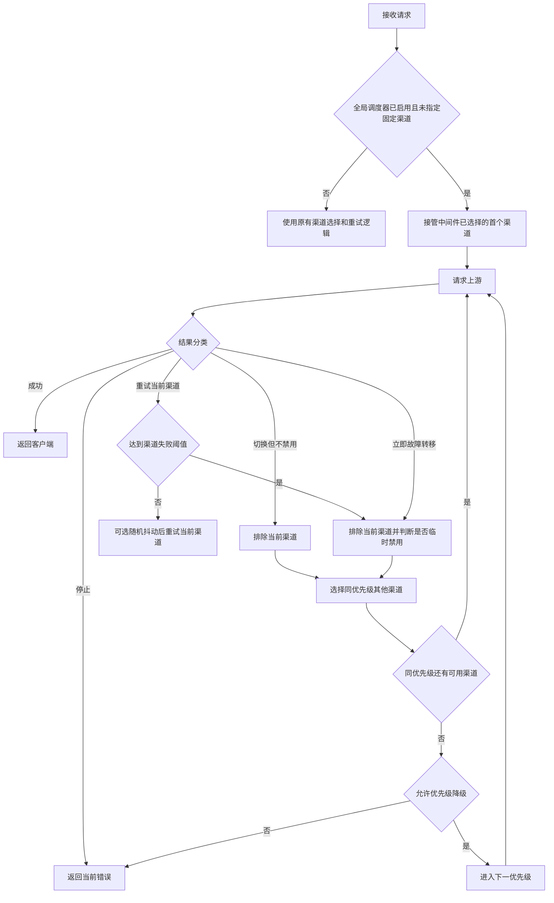

# New API 个人二开说明

> 本仓库是基于 [QuantumNous/new-api](https://github.com/QuantumNous/new-api) 的个人二开版本，不代表上游官方发行版。New API、QuantumNous、原项目许可证、NOTICE、模块路径和原始署名均保持不变。

本文只说明本分支相对上游新增或调整的部分。New API 原有功能、部署参数和使用方式请继续查阅[主 README](./README.md)、[简体中文 README](./README.zh_CN.md)和[上游官方文档](https://docs.newapi.pro/)。

## 上游关系

| 项目 | 内容 |
| --- | --- |
| 上游仓库 | [QuantumNous/new-api](https://github.com/QuantumNous/new-api) |
| 个人仓库 | [ccw-HE/new-api](https://github.com/ccw-HE/new-api) |
| 功能分支 | `feature/scheduler-failover` |
| 分叉基准 | `69b0f0b56f528efa292a2893feb0c55c37399f4b` |
| 主要方向 | 高级渠道调度、同级故障转移、转发韧性、调度日志和依赖安全维护 |

当前二开说明只维护中文版本。本分支暂未向上游提交 PR，文中能力不应被理解为上游版本已经支持。

## 功能总览

| 能力 | 解决的问题 | 管理入口或实现位置 |
| --- | --- | --- |
| 高级渠道调度器 | 单个渠道连续失败时，先在同优先级内完成故障转移，再决定是否降级 | 渠道页面的“高级调度器” |
| 临时禁用与恢复 | 避免故障渠道持续承接请求，同时防止并发恢复覆盖新一轮禁用 | 临时禁用渠道列表、后台系统任务 |
| 全局和渠道级配置 | 允许统一配置默认行为，并为特殊渠道覆盖阈值与禁用时长 | 高级调度器全局设置、单渠道设置 |
| 重试可靠性规则 | 把自动重试和旧式自动禁用状态码从硬编码改为可配置范围 | 系统设置中的路由可靠性配置 |
| 调度日志与统计 | 记录失败、观察禁用、实际禁用和恢复过程 | 使用日志中的“调度日志” |
| 日志维护 | 支持按时间清理调度日志，并复用后台任务租约和批处理机制 | 系统设置中的日志清理 |
| 空响应检测 | 避免把没有可交付内容的上游响应当作成功结果 | OpenAI、Responses、Gemini、Claude 转发链路 |
| Header 继承与安全透传 | 保留客户端业务 Header，同时跳过协议级和敏感 Header | 渠道 Header 覆盖配置 |
| 请求与流生命周期加固 | 减少重试时请求体已消费、Content-Length 不一致或流提前结束 | Relay 和 Web 进程生命周期逻辑 |
| 依赖与上传安全 | 修复已知依赖漏洞，避免环境文件和本地开发目录进入 Git 或镜像 | Go、Web、Electron 锁文件及忽略规则 |

## 高级渠道调度器

### 和旧调度逻辑的区别

旧逻辑中的重试次数更接近“尝试多少个优先级层级”。高级调度器改成按单次请求维护独立会话：一个渠道可以在当前请求内连续尝试到失败阈值，达到阈值后将它从本次会话排除，并在满足条件时临时禁用，然后继续选择同优先级的其他渠道。只有同级候选耗尽且启用了优先级降级，才会进入更低优先级。



### 启用条件和回退行为

- 全局 `enabled` 默认是 `false`。关闭时不改变原有渠道分配和重试行为。
- 请求通过 `specific_channel_id` 指定固定渠道时，高级调度器不会接管。
- 调度器创建会话或加载候选失败时，请求回退到旧调度逻辑，并写入系统错误日志，不会因为新增模块初始化失败而直接中断。
- 调度器接管中间件已经选好的首个渠道，再把内部游标对齐到该渠道所在的分组和优先级桶。
- Token 分组为 `auto` 时，候选按用户自动分组顺序展开。只有启用 Token 跨分组重试时，调度会话才会继续保留后续分组。

### 候选渠道、优先级和权重

- 候选查询同时支持内存缓存和数据库直查，两条路径都按 `priority` 从高到低分桶。
- 同一优先级中使用渠道权重进行随机选择，低平均权重和全零权重仍使用项目原有的平滑处理。
- Advanced Custom 渠道继续按当前请求路径筛选，不会因为使用新调度器而绕过路径约束。
- 每次选择前会过滤已经被本会话排除或被并发请求改成非启用状态的渠道。
- `retry_same_channel=true` 时，当前渠道在未达到阈值前继续被选择。关闭后，如果同级存在其他可用渠道，会优先轮换到其他渠道。
- `allow_priority_fallback=false` 时，当前优先级耗尽后结束调度，不再尝试低优先级渠道。

### 单次请求计数和尝试保险丝

失败次数只存在于当前请求的调度会话，不会跨请求、跨进程或跨节点累积。临时禁用的最终状态由数据库事务和 CAS 条件保护，但“连续失败 N 次”的计数本身不是全局熔断计数。

每次请求的尝试预算按所有启用候选渠道的有效阈值累加，并设置 `10000` 次内部上限。该上限用于阻止异常候选集或错误配置形成无界循环，不是建议配置成大量重试。

### 错误分类

调度器不会把所有失败都当成相同故障。控制器会把错误归为以下四种处置：

| 处置 | 行为 | 典型情况 |
| --- | --- | --- |
| `stop` | 停止调度并返回错误 | 请求上下文已取消、固定渠道请求、明确禁止重试、正常 `2xx` 但业务链路决定停止 |
| `retry_current` | 当前渠道失败计数加一，未到阈值时继续当前渠道 | 渠道错误、空响应、配置为可重试的状态码 |
| `failover_without_disable` | 从本次会话排除当前渠道，但不执行临时禁用 | 建连或发送请求失败、上游内容拦截 |
| `failover_now` | 跳过常规累计等待，进入受保护的排除和临时禁用判断 | 未被配置规则覆盖的 `408`、`429` 或 `5xx` |

如果错误最终进入临时禁用判断，数据库仍会重新检查渠道状态。并发请求已经禁用该渠道、管理员已经手动改变状态或其他状态条件不再满足时，本次禁用会被拒绝并记录为观察事件。

### HTTP 状态码规则

本分支把自动重试和旧式自动禁用状态码改成可配置规则，支持逗号分隔的单值和闭区间，例如：

```text
401,408,429,500-503
```

解析器接受中文逗号，会去除空格、排序并合并相邻区间，同时拒绝小于 `100`、大于 `599`、起点大于终点或无法解析的内容。

默认自动重试范围为：

```text
100-199,300-399,401-407,409-499,500-503,505-523,525-599
```

`504`、`524` 和 `bad_response_body` 错误具有强制跳过重试保护。默认自动禁用状态码是 `401`。

高级调度器主要读取自动重试规则决定是否继续当前渠道。旧调度路径和多 Key 渠道的 Key 级处理仍会使用自动禁用规则，因此这两组配置不能简单视为同一个开关。

### 重试随机抖动

重试抖动用于在集中故障时分散瞬时重试：

- 最小值和最大值都是 `0` 时关闭。
- 非零配置必须位于 `100-10000` 毫秒，并且最小值不能大于最大值。
- 两个值相等时使用固定延迟，不相等时在闭区间内随机取值。
- 等待期间如果客户端取消请求，会立即停止并返回带“跳过后续重试”标记的请求失败错误。
- 从旧配置或其他来源读取到非法区间时，运行时按不启用抖动处理；管理 API 会直接拒绝非法配置。

## 临时禁用和恢复

### 临时禁用事务

达到阈值后，调度器先把渠道从当前请求排除，再根据渠道配置决定是否实际禁用。实际禁用包含以下原子步骤：

1. 只查询当前仍为启用状态的渠道。
2. 写入 `status=auto_disabled`、`auto_disabled_until`、状态原因和状态时间。
3. 在同一事务内把对应 Ability 记录设为不可用。
4. 提交成功后同步内存缓存中的渠道状态和到期时间。
5. 记录脱敏调度日志，并向 Root 用户发送渠道临时禁用通知。

数据库更新使用带旧状态和旧 `other_info` 的 CAS 条件。并发的手动禁用、旧式自动禁用或另一请求的新一轮禁用不会被本次事务覆盖。

全局默认禁用时长是 `7200` 秒，可配置范围是 `1` 秒到 `30` 天。渠道可以继承全局时长，也可以单独覆盖。

### 渠道级“参与高级调度”开关的实际边界

当前实现中，`scheduler_enabled=false` 不会在候选加载阶段直接删除该渠道。它仍可能被当前请求选中和重试，但达到阈值后只会从本次会话排除，不会写入数据库临时禁用状态，并记录 `observe_disable`。管理界面的“参与高级调度”应按这个实际行为理解。

如果 `respect_auto_ban=true` 且渠道自身关闭了 `auto_ban`，行为相同：渠道会从当前请求排除，但不会被调度器临时禁用。

### 自动恢复

- 系统任务调度器定期检查已经到期的调度器临时禁用渠道，恢复处理器的计划间隔是 1 分钟。
- 系统空闲时不会反复创建无意义的恢复任务记录。只有存在可恢复渠道时，恢复处理器才进入工作队列。
- 即使全局高级调度器已经关闭，历史遗留的临时禁用渠道仍能按到期规则恢复。
- 自动恢复只处理 `status=auto_disabled`、`auto_disabled_until>0`、已到期且渠道未关闭自动恢复的记录。
- 手动禁用渠道和旧式没有到期时间的自动禁用渠道不受影响。
- 恢复事务会重新匹配扫描时的 `auto_disabled_until`。如果渠道已经进入新一轮禁用，旧任务无法覆盖新的到期时间。
- 恢复成功后会重新启用 Ability，并重建渠道缓存，使渠道重新进入候选集合。

### 手动恢复

Root 管理员可以对调度器临时禁用渠道执行手动恢复，但当前实现要求：

- 渠道必须处于调度器临时禁用状态。
- `auto_disabled_until` 必须大于 `0` 且已经到期。
- 渠道级 `scheduler_manual_restore_allowed` 不能为 `false`。

因此，手动恢复不是“提前解除尚未到期的禁用”。它用于自动恢复关闭、任务延迟或管理员需要在到期后立即恢复的情况。恢复操作会写入调度日志和管理审计日志。

## 配置参考

### 全局配置

| 字段 | 默认值 | 约束 | 作用 |
| --- | ---: | --- | --- |
| `enabled` | `false` | 布尔值 | 启用高级调度器；关闭时使用旧调度逻辑 |
| `channel_failure_threshold` | `3` | `1-100` | 单渠道在单次请求中的连续失败阈值 |
| `auto_disable_seconds` | `7200` | `1-2592000` | 达到阈值后的临时禁用时长，最大 30 天 |
| `retry_jitter_min_ms` | `0` | `0` 或 `100-10000` | 重试随机延迟下限 |
| `retry_jitter_max_ms` | `0` | `0` 或 `100-10000`，且不小于下限 | 重试随机延迟上限 |
| `allow_priority_fallback` | `true` | 布尔值 | 同优先级耗尽后是否进入低优先级 |
| `log_enabled` | `true` | 布尔值 | 是否写入独立调度日志 |
| `respect_auto_ban` | `true` | 布尔值 | 是否尊重渠道自身的自动封禁开关 |
| `retry_same_channel` | `true` | 布尔值 | 是否优先在同一渠道重试至阈值 |

全局设置通过 `channel_scheduler_setting.*` 选项持久化。保存全局配置需要 Root 权限。

### 渠道级配置

| 字段 | 默认继承行为 | 作用 |
| --- | --- | --- |
| `scheduler_enabled` | `null` 等同于 `true` | 控制达到阈值后是否允许调度器实际临时禁用 |
| `scheduler_retry_times` | `null` 继承全局阈值 | 渠道自己的失败阈值，范围 `1-100` |
| `scheduler_auto_disable_seconds` | `null` 继承全局时长 | 渠道自己的禁用时长，范围 `1` 秒到 `30` 天 |
| `scheduler_auto_recover_enabled` | `null` 等同于 `true` | 到期后是否允许后台任务自动恢复 |
| `scheduler_manual_restore_allowed` | `null` 等同于 `true` | 到期后是否允许 Root 管理员手动恢复 |
| `auto_disabled_until` | `0` | 当前调度器临时禁用的 Unix 到期时间 |

渠道配置 API 采用全量替换语义。请求字段为 `null` 时会清除渠道级覆盖，让该字段重新使用全局或内置默认值。保存后会重建渠道缓存。

## 调度日志与维护

### 事件类型

调度日志单独存放在主数据库的 `channel_scheduler_logs` 表，不使用独立的 `LOG_DB`。

| 事件 | 含义 |
| --- | --- |
| `failure` | 单次渠道失败，观察和正式调度都会记录 |
| `observe_disable` | 已达到禁用条件，但因为渠道设置、`auto_ban`、并发状态变化等原因没有实际禁用 |
| `auto_disable` | 已完成调度器临时禁用 |
| `auto_recover` | 禁用到期后由后台任务自动恢复 |
| `manual_restore` | 到期后由管理员手动恢复 |

### 记录内容

每条日志可以包含请求 ID、用户、Token、分组、模型、渠道 ID、渠道名称、渠道类型、优先级、尝试次数、禁用时长、禁用截止时间、HTTP 状态码、错误代码、错误类型、脱敏原因、已使用渠道和扩展元数据。

日志查询支持事件、请求 ID、渠道、模型、分组、优先级、起止时间和分页筛选。统计接口提供各事件总数，以及最多 50 个渠道的失败和禁用次数排行。

日志写入失败只写入系统错误日志，不把失败继续传播到转发主链路。管理员可以按截止时间删除旧日志，系统设置也可以通过后台任务分批清理历史日志。后台任务使用任务认领、租约心跳、取消检查和分批删除，避免一个长清理任务长期占用锁或一次删除过多记录。

全局调度配置、渠道级配置、手动恢复和调度日志清理都会写入管理审计日志。

## 管理界面

Default 前端增加了以下入口：

- 渠道列表中的高级调度器入口。
- 全局设置页签，包括临时禁用渠道列表和全局参数。
- 单渠道调度配置对话框，可查看原始值、有效值和当前禁用状态。
- 使用日志中的调度日志页面，包括事件筛选、请求和渠道筛选、时间范围、统计和详情。
- 系统设置中的日志保留和清理入口，调度日志可作为独立日志类型处理。

相关用户界面文本已经同步到 `en`、`zh`、`fr`、`ja`、`ru`、`vi` 六种前端语言文件。

## 管理 API

下划线前缀 `/api/channel_scheduler` 是前端当前使用的路径，连字符前缀 `/api/channel-scheduler` 作为兼容路由保留。

| 方法和路径 | 权限 | 用途 |
| --- | --- | --- |
| `GET /api/channel_scheduler/logs` | Admin | 分页查询调度日志 |
| `GET /api/channel_scheduler/logs/stat` | Admin | 查询时间范围内的调度统计 |
| `DELETE /api/channel_scheduler/logs` | Root | 删除指定时间之前的调度日志 |
| `GET /api/channel_scheduler/disabled` | Admin | 查看调度器临时禁用渠道，响应不包含渠道 Key |
| `GET /api/channel_scheduler/config` | Root | 获取全局调度配置 |
| `PUT /api/channel_scheduler/config` | Root | 保存全局调度配置 |
| `GET /api/channel_scheduler/channel/:id/config` | Admin | 查看渠道原始值和有效配置 |
| `PUT /api/channel_scheduler/channel/:id/config` | Root | 全量替换渠道级配置 |
| `POST /api/channel_scheduler/restore/:id` | Root | 恢复已经到期的调度器临时禁用渠道 |

## 转发韧性改进

### 空响应识别

高级调度器需要区分“上游成功返回有效内容”和“HTTP 请求成功但没有可交付内容”。本分支为以下格式增加了内容检查：

- OpenAI Chat：文本、推理内容或工具调用任一存在即视为有效。
- OpenAI Responses：输出文本、函数调用、图像生成调用或其他工具调用视为有效。
- Gemini：文本、函数调用、内联媒体、可执行代码或代码执行结果视为有效。
- Claude：Completion 文本、Content 文本、Thinking 或工具调用视为有效。
- OpenAI 流式响应：持续跟踪文本、推理和工具调用；整个流结束后仍没有有效载荷时生成统一空响应错误。

空响应会转换为 `502` 类型的统一错误，使重试或故障转移能够按调度规则处理。该检测只验证是否存在可交付结构，不判断生成内容的业务质量。

### Header 继承、占位符和安全透传

渠道 Header 覆盖支持：

- `{api_key}`：替换为当前渠道 API Key。
- `{client_header:<name>}`：读取客户端请求中的指定 Header。客户端内容不会再次展开 `{api_key}`，避免二次插值。
- `"*"` 规则：控制是否默认透传安全的客户端 Header。
- `re:<regex>` 和 `regex:<regex>`：按 Go 正则表达式选择要透传的 Header 名。

Header 处理先应用透传规则，再应用显式渠道覆盖，因此显式配置优先。适配器已经生成同名 Header 时，普通透传值不会覆盖适配器结果；明确配置的渠道覆盖仍然可以生效。

以下类型不会被透传规则盲目复制：Hop-by-hop Header、`Host`、Cookie、认证信息、内容长度、代理认证、WebSocket 握手 Header，以及其他由 HTTP 客户端或适配器负责生成的协议字段。空正则、非法正则、缺少请求上下文和非字符串配置会返回明确的渠道 Header 配置错误。

### 请求体和流式生命周期

- 重试链路复用可重新读取的请求体存储，避免第一次请求消费 Body 后后续尝试拿到空 Body。
- 请求体长度未知时不会把错误的长度值强制写给上游，降低 Content-Length 与实际 Body 不一致的风险。
- 流式代理保留必要的上游响应 Header，并加强请求上下文和 Web 进程生命周期处理，减少流尚未结束时连接或开发进程被提前关闭的问题。

## 数据库和缓存兼容性

- 新增渠道级调度字段、`channel_scheduler_logs` 表和 `scheduler_recover` 系统任务类型。
- 数据库迁移继续使用项目现有 GORM 迁移流程，不需要手工执行专用 SQL。
- SQLite、MySQL 和 PostgreSQL 均属于支持范围。
- 调度日志当前写入主数据库。配置独立日志数据库不会移动这张表。
- 内存缓存开启和关闭时都使用相同的优先级分桶语义。
- 禁用成功后增量更新缓存；恢复成功后整体重建渠道缓存，使 Ability 与候选集合重新一致。

升级前仍建议备份数据库。生产环境应先在副本验证迁移和回滚预案，尤其是数据量较大的渠道表和日志表。

## 安装、构建与验证

### 环境要求

- Go `1.25.1` 或更高版本。当前 `go.mod` 声明为 `go 1.25.1`。
- Bun，前端首选包管理器和脚本运行器。
- Node.js 与 npm，用于 Electron 依赖维护和桌面端构建。
- 可选：Docker、Gitleaks、govulncheck。

先确认工具可用：

```powershell
go version
bun --version
node --version
npm --version
```

### Go 后端

```powershell
go mod download
go test ./...
go build -o "$env:TEMP\new-api-fork-check.exe" .
govulncheck ./...
```

### Web 前端

```powershell
Set-Location web
bun install --frozen-lockfile
bun audit

Set-Location default
bun run typecheck
bun test
bun run build

Set-Location ..\classic
bun run build
```

Default 前端测试使用 Bun 内置测试运行器，仓库没有名为 `test` 的 package script，因此命令是 `bun test`，不是 `bun run test`。

### Electron

```powershell
Set-Location electron
npm ci
npm audit
npm ls --all
node --check main.js
node --check preload.js
npx electron-builder --version
```

### Docker

上游 `docker-compose.yml` 默认引用 `calciumion/new-api:latest`，该公开镜像不包含本分支二开功能。使用本分支时需要自行构建镜像：

```powershell
docker build -t ccw-he/new-api:scheduler-failover .
docker run --name new-api-fork -d --restart always `
  -p 3000:3000 `
  -e TZ=Asia/Shanghai `
  -v "${PWD}\data:/data" `
  ccw-he/new-api:scheduler-failover
```

需要 Compose 时，应复制或覆盖现有服务的 `image` 配置，使其指向自己构建的镜像，并在启动前修改数据库、Redis、Session 等默认密码。

## 依赖与上传安全

本轮依赖维护包括：

- Go：升级 `golang.org/x/image`、`golang.org/x/net`、`golang.org/x/sync` 和 `golang.org/x/text`。
- Web：更新 DOMPurify、Hono、Vite、esbuild、form-data、minimist 等直接或传递依赖约束，并刷新 `web/bun.lock`。
- Electron：刷新 `electron/package-lock.json` 中的安全修复版本。

`.gitignore` 和 `.dockerignore` 默认排除：

```text
.env
.env.*
.snow/
```

`.env.example` 和 `.env.*.example` 仍允许提交，用于保存不含真实凭据的配置示例。提交前应确认 Git 只追踪示例环境文件：

```powershell
git ls-files | rg "(^|/)(\.env($|\.)|\.snow(/|$))"
```

敏感信息检查可以使用：

```powershell
git diff HEAD | gitleaks stdin --no-banner --redact
gitleaks git . --no-banner --redact
```

第一条检查当前未提交差异，第二条检查完整 Git 历史。扫描命中需要逐项确认，测试 Token、文档占位符和协议固定字段可能产生误报，但不能在未核实前直接加入全局忽略。

依赖审计只反映执行当天的漏洞数据库状态。后续同步上游或更新锁文件后，需要重新运行 `bun audit`、`npm audit` 和 `govulncheck ./...`。

## 已知限制

- 高级调度器默认关闭，需要 Root 管理员显式启用。
- 单渠道失败计数只在单次请求内存在，不是跨请求或跨节点的全局熔断器。
- 调度日志增加主数据库写入量和存储占用，需要配置保留和清理策略。
- 自动恢复是分钟级后台任务，不承诺到期后立即在同一秒恢复。
- 手动恢复只允许处理已经到期的临时禁用，不能提前解除仍在有效期内的禁用。
- `scheduler_enabled=false` 当前主要阻止实际临时禁用，不会在候选加载阶段完全排除渠道。
- 关闭优先级降级后，同优先级候选耗尽会结束本次调度。
- 空响应检测只能判断是否存在可交付载荷，无法判断内容质量或业务正确性。
- 调度器基于可观测错误和状态码分类，无法自动理解所有上游厂商的业务语义。
- 当前详细二开说明只维护中文版本。
- 本分支没有向上游提交 PR，不应被视为上游官方功能或官方支持承诺。

## 同步上游

建议保持两个远端：

```powershell
git remote -v
# origin   https://github.com/ccw-HE/new-api.git
# upstream https://github.com/QuantumNous/new-api.git
```

同步时先在独立分支检查上游差异：

```powershell
git fetch upstream
git switch -c sync/upstream-main
git merge upstream/main
```

也可以根据团队习惯使用 rebase，但不要用破坏性 `git reset --hard` 覆盖尚未备份的二开提交。README 入口保持精简、详细差异集中在本文，就是为了减少上游 README 更新时的冲突。

每次同步后至少重新运行：

- `go test ./...` 和 `govulncheck ./...`
- Default 前端类型检查、测试和构建
- Classic 前端构建
- `bun audit` 和 `npm audit`
- Gitleaks 当前差异与完整历史扫描

## 许可证与署名

本仓库继续遵循 [GNU Affero General Public License v3.0](./LICENSE)。修改和分发时必须保留 [NOTICE](./NOTICE) 中的原始归属、用户界面归属说明和上游项目链接。

根据 AGPLv3 和 NOTICE：

- 不得删除或替换 New API、QuantumNous 和贡献者的原始署名。
- 修改版本需要清楚标记变更，不能误导使用者认为二开内容来自上游官方版本。
- 向公众提供修改后的网络服务时，应履行 AGPLv3 对应源代码提供义务。
- 发布二进制、Docker 镜像、前端包或 Electron 安装包时，应一并保留 LICENSE、NOTICE 和第三方许可证文件。

本说明用于标记个人二开内容，不改变原项目的名称、作者身份、许可证或其他法律声明。
