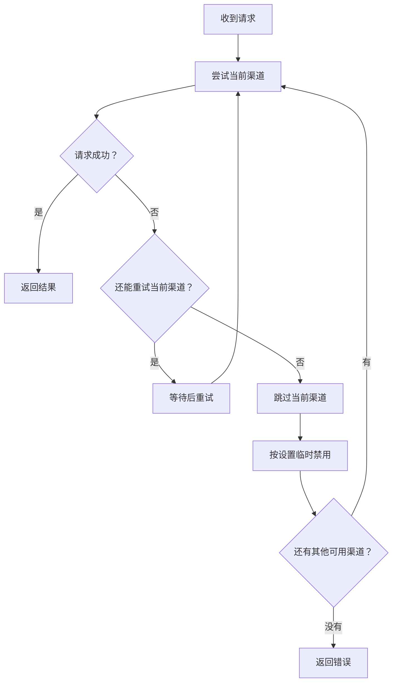

# New API 调度增强版

本仓库基于 [QuantumNous/new-api](https://github.com/QuantumNous/new-api)，保留完整的 New API 网关功能，并提供渠道故障转移、自动禁用与恢复、调度日志和 Windows 本地启动支持。

- 项目仓库：[ccw-HE/new-api](https://github.com/ccw-HE/new-api)
- 上游仓库：[QuantumNous/new-api](https://github.com/QuantumNous/new-api)
- 使用文档：[docs.newapi.pro](https://docs.newapi.pro/)
- 基础说明：[README.md](./README.md)、[README.zh_CN.md](./README.zh_CN.md)

本文介绍本仓库提供的主要功能和常用设置。New API、QuantumNous、许可证、NOTICE、模块路径和原始署名保持不变。

## 主要功能

| 功能 | 说明 |
| --- | --- |
| 渠道故障转移 | 当前渠道请求失败时，自动尝试同优先级的其他渠道，也可以按设置继续尝试低优先级渠道 |
| 自动禁用与恢复 | 连续失败的渠道可以临时停用，到期后自动恢复，管理员也可以随时手动启用 |
| 灵活重试 | 可以设置失败阈值、需要重试的 HTTP 状态码，以及重试前的等待时间 |
| 空响应检测 | 上游没有返回有效内容时，继续重试或切换渠道 |
| 调度日志 | 查看渠道失败、自动禁用、自动恢复和人工恢复记录 |
| Header 安全透传 | 透传需要的客户端 Header，同时过滤认证信息和协议字段 |
| 出站请求防护 | 对模型获取、文件下载、OAuth 配置发现等服务器请求进行 SSRF 检查 |
| 请求体与流式请求保护 | 重试时可以重新读取请求体，流式请求也能正确结束 |
| Windows 一键启动 | 使用 `start.bat` 启动 Docker、后端和 Default WebUI |

## 渠道调度怎么工作

高级调度器会为每次请求单独选择和尝试渠道。某个渠道连续失败达到阈值后，系统会跳过这个渠道，尝试其他可用渠道，并根据设置决定是否临时禁用故障渠道。



主要规则：

- 高级调度器默认关闭，需要 Root 管理员在渠道页面中开启。
- 指定固定渠道的请求仍使用指定渠道，不会自动切换。
- 渠道按优先级从高到低选择，同一优先级内参考渠道权重。
- 开启“重试当前渠道”后，当前渠道会重试到失败阈值。
- 开启“优先级降级”后，同优先级渠道都不可用时会继续尝试低优先级渠道。
- 失败次数只在当前请求中计算，不会累加到其他请求。

## 常用设置

### 全局设置

在渠道页面的高级调度设置中，可以修改以下选项：

| 设置 | 默认值 | 作用 |
| --- | ---: | --- |
| 启用高级调度器 | 关闭 | 是否使用渠道故障转移功能 |
| 渠道失败阈值 | `3` | 单个渠道连续失败多少次后切换 |
| 临时禁用时间 | `7200` 秒 | 故障渠道保持禁用的时间 |
| 重试等待 | 关闭 | 设置固定等待或随机等待时间 |
| 优先级降级 | 开启 | 当前优先级不可用时是否继续尝试低优先级 |
| 调度日志 | 开启 | 是否记录调度过程 |
| 重试当前渠道 | 开启 | 是否先把当前渠道重试到失败阈值 |

单个渠道也可以设置自己的失败阈值、临时禁用时间和自动恢复选项。留空时使用全局设置。

### HTTP 状态码规则

自动重试和自动禁用可以分别设置，支持单个状态码和连续范围，例如：

```text
401,408,429,500-503
```

状态码必须在 `100-599` 之间。空响应没有 HTTP 错误码，也会按渠道请求失败处理。

### 重试等待

重试等待可以减少大量请求同时重试故障渠道的情况：

- 最小值和最大值都设为 `0` 时关闭。
- 两个值相同表示固定等待。
- 两个值不同表示在范围内随机等待。
- 可设置范围为 `100-10000` 毫秒。

## 临时禁用与恢复

渠道达到失败阈值后，系统会先从本次请求中跳过该渠道。如果允许自动禁用，渠道会进入临时禁用状态，默认禁用 `7200` 秒。

系统每分钟检查一次到期渠道并自动恢复。管理员也可以随时在渠道列表中点击“启用”，立即恢复渠道。手动禁用的渠道不会被这项自动恢复任务启用。

## 调度日志

调度日志可以查看以下事件：

| 事件 | 含义 |
| --- | --- |
| `failure` | 渠道请求失败 |
| `auto_disable` | 渠道被临时禁用 |
| `auto_recover` | 渠道到期后自动恢复 |
| `manual_restore` | 管理员手动恢复渠道 |

管理入口：

- 渠道页面：全局调度设置和临时禁用渠道列表。
- 渠道行操作：单个渠道的调度设置。
- 使用日志页面：筛选和查看调度日志。
- 渠道列表：使用普通“启用”操作恢复渠道。

调度日志会占用数据库空间，建议根据请求量设置合适的保留时间。

## 空响应与安全转发

系统会检查 OpenAI Chat、Responses、Gemini、Claude 等响应是否包含有效内容。上游只返回成功状态码但没有可用内容时，会继续重试或切换渠道。

渠道 Header 设置支持以下写法：

- `{api_key}`：使用当前渠道的 API Key。
- `{client_header:<name>}`：读取客户端请求中的指定 Header。
- `"*"`：继承安全的客户端 Header。
- `re:<regex>` 和 `regex:<regex>`：按 Header 名匹配需要透传的字段。

认证信息、Cookie、Host、Content-Length 和连接控制字段不会被通配或正则规则直接透传。显式填写的渠道 Header 优先级更高。

## 安全提示

- 建议保持系统设置中的 SSRF 防护开启。
- 如果需要访问局域网中的 Ollama 或其他自建服务，请允许私有 IP，并加入实际使用的端口。
- 生产环境请设置安全的数据库、Redis、Session 和管理员凭据，并做好数据备份。
- 如果发现安全问题，请按照 [SECURITY.md](./.github/SECURITY.md) 提交私密漏洞报告，不要创建公开 Issue。

## 下载与启动

### 下载发行版

前往 [`v1.0.0-rc.15-ccw.1` 发行页面](https://github.com/ccw-HE/new-api/releases/tag/v1.0.0-rc.15-ccw.1)，下载适合当前系统的文件。页面提供 Linux、macOS 和 Windows 构建，以及对应的 SHA-256 校验文件。

使用 Docker 或其他部署方式时，请参考 [New API 官方文档](https://docs.newapi.pro/)。生产环境更新程序前，请先备份数据库。

### Windows 本地启动

已安装 Docker Desktop 和 Bun 后，在仓库根目录双击 `start.bat`，或运行：

```powershell
.\start.bat
```

脚本会启动后端、PostgreSQL、Redis 和 Default WebUI。

| 命令 | 作用 |
| --- | --- |
| `.\start.bat` | 启动本地环境 |
| `.\start.bat build` | 重新构建后端镜像并启动 |
| `.\start.bat probe` | 检查是否需要重新构建镜像 |
| `.\start.bat stop` | 停止 WebUI 和相关服务 |
| `.\start.bat stop-all` | 停止服务并请求关闭 Docker Desktop |

## 使用限制

- 自动恢复任务每分钟执行一次，不保证在到期的同一秒恢复。
- 空响应检测只能判断是否有可用内容，不能判断回答质量。
- 故障转移需要至少有一个其他可用渠道，否则会返回当前错误。
- 支持 SQLite、MySQL 和 PostgreSQL，更新生产环境前请先备份并测试数据库迁移。

## 许可证与署名

本仓库遵循 [GNU Affero General Public License v3.0](./LICENSE)。修改和分发时必须保留 [NOTICE](./NOTICE) 中的原始归属、用户界面署名和上游项目链接。

- 不得删除或替换 New API、QuantumNous 和贡献者的原始署名。
- 向公众提供修改后的网络服务时，应履行 AGPLv3 对应的源代码提供义务。
- 发布二进制、Docker 镜像或前端包时，应保留 LICENSE、NOTICE 和第三方许可证文件。
